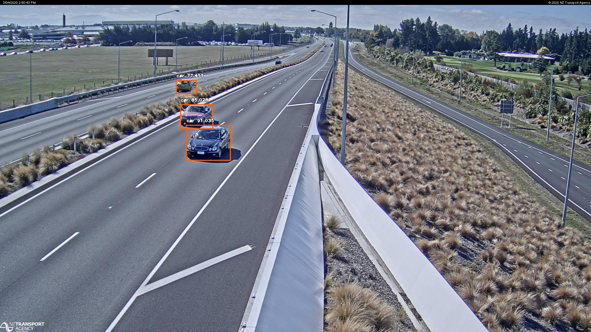
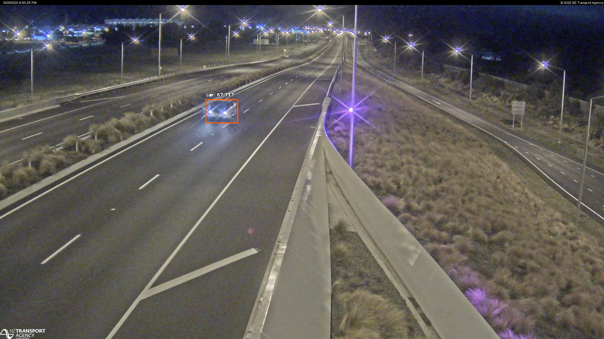

# NZTA_traffic_cameras
A Python script to automatically collect images from all NZTA traffic cameras (https://www.journeys.nzta.govt.nz/traffic-and-travel-information/traffic-cameras/) and detect vehicles

